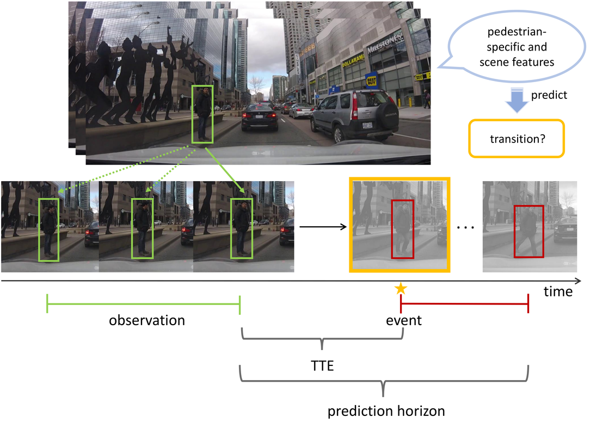
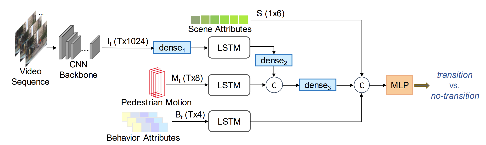

# Pedestrian Stop and Go Forecasting with Hybrid Feature Fusion

[PyTorch](https://pytorch.org/) implementation of paper [Pedestrian Stop and Go Forecasting with Hybrid Feature Fusion](https://arxiv.org/abs/2203.02489) by Dongxu Guo , Taylor Mordan and Alexandre Alahi. The project is conducted within École Polytechnique Fédérale de Lausanne (EPFL), Visual Intelligence for Transportation (VITA).


#### Abstract

> Pedestrian Stop and Go Forecasting with Hybrid Feature Fusion
>Forecasting pedestrians’ future motions is essential for autonomous driving systems to safely navigate in urban areas. 
>However, existing prediction algorithms often overly rely on past observed trajectories and tend to fail around abrupt dynamic changes, such as when pedestrians suddenly start or stop walking.
>We suggest that predicting these highly nonlinear transitions should form a core component to improve the robustness of motion prediction algorithms. 
>In this paper, we introduce the new task of pedestrian stop and go forecasting.
>Considering the lack of suitable existing datasets for it, we release TRANS, a benchmark for explicitly studying the stop and go behaviors of pedestrians in urban traffic.
>We build it from several existing datasets annotated with pedestrians’ walking motions, in order to have various scenarios and behaviors. 
>We also propose a novel hybrid model that leverages pedestrian-specific and scene features from several modalities, both video sequences and high-level attributes, and gradually fuses them to integrate multiple levels of context.
>We evaluate our model and several baselines on TRANS, and set a new benchmark for the community to work on pedestrian stop and go forecasting.





### Table of Contents

- [Installation](#installation)
- [Dataset](#dataset)
- [Model](#model)
- [Training](#training)
- [Evaluation](#evaluation)
- [Citation](#citation)
- [Acknowledgements](#acknowledgements)


## Installation

Clone this repository in order to use it.
```
# To clone the repository using HTTPS
git clone https://github.com/vita-epfl/hybrid-feature-fusion.git
cd hybrid-feature-fusion/
```

All dependencies can be found in the `requirements.txt` file.
```
# To install dependencies
pip3 install -r requirements.txt
```

This project has been tested with Python 3.7.7, PyTorch 1.9.1, CUDA 10.2.


## Dataset

This project uses our benchmark [TRANS](https://github.com/vita-epfl/pedestrian-transition-dataset) for training and evaluation.

Please follow the [instructions](https://github.com/vita-epfl/pedestrian-transition-dataset#data-preparation) to prepare the data.

## Model

The model encodes pedestrian-specific features jointly with dynamics and contextual information.Both feed-forward and recurrent structures are utilized to process
multi-modal inputs. We conduct all experiments on our new TRANS dataset and compare the performance of the proposed model to a
series of baselines.

## Training

Here we give an example to train the hybrid model for "go" predictiing :
```
python3 train_IMBS.py --jaad --pie --titan \
        --mode GO --jitter-ratio 2.0 --fps 5 --pred 10 --max-frames 5 -lr 1e-4  -wd 1e-5 --bbox-min 24 --epochs 20
```
Arguments should be modified according to your local settings if needed.

The weights of the encoder CNN can be obtained by training the corresponding static [baselines](https://github.com/vita-epfl/hybrid-feature-fusion/src/model/baselines.py) for the same classification task. Please refer to our [paper](https://arxiv.org/abs/2203.02489) for more implementation details.


## Evaluation

Evaluation on JAAD/PIE/TITAN can be run with the similar command:
```
python3  eval_hybrid.py\
  --jaad --pie --titan
  --encoder-path <path/to/encoder-checkpoint>
  --decoder-path <path/to/decoder-checkpoint>
  --mode GO --jitter-ratio 2.0 --fps 5 --pred 10 --max-frames 5 --bbox-min 24
```
Arguments shall be modified appropriately based on your need.

## Results
We visualize some results of our full proposed Hybrid model on JAAD [43] and PIE [44] datasets. The predictions for future
transitions and non-transitions are indicated by red and green boxes respectively.


## Citation
If you use this project in your research, please cite the corresponding paper:
```text
@article{guo2022pedestrian,
  title={Pedestrian Stop and Go Forecasting with Hybrid Feature Fusion},
  author={Guo, Dongxu and Mordan, Taylor and Alahi, Alexandre},
  journal={arXiv preprint arXiv:2203.02489},
  year={2022}
}
```


## Acknowledgements

We would like to thank Valeo and EPFL for funding our work, and the members from VITA for their helpful advice. Credits to [JAAD](http://data.nvision2.eecs.yorku.ca/JAAD_dataset/),
[PIE](http://data.nvision2.eecs.yorku.ca/PIE_dataset/) and [TITAN](https://usa.honda-ri.com/titan) for providing the source data.
